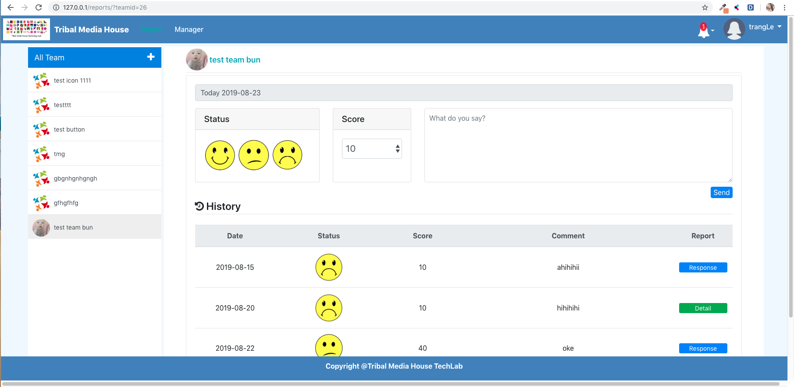
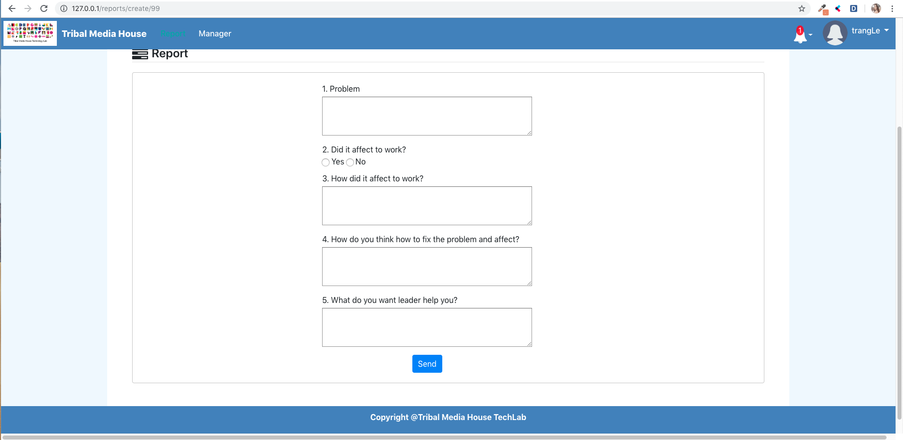
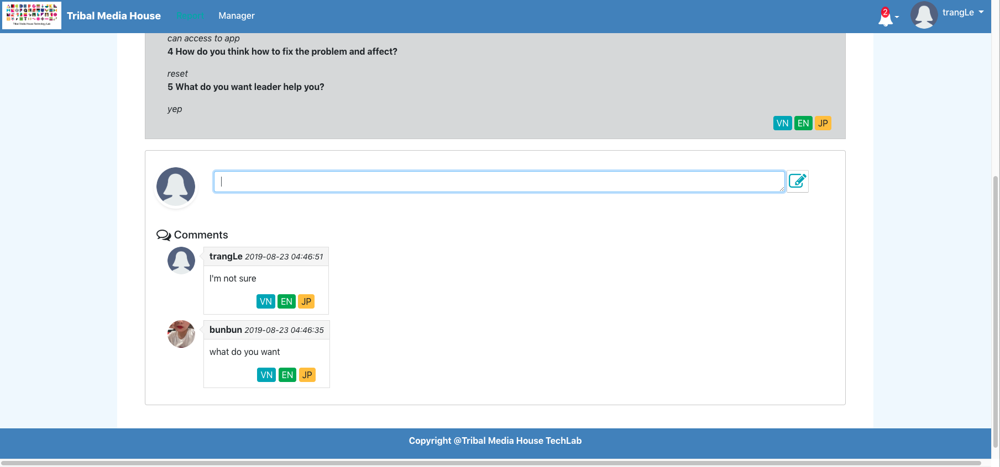

# Make Happy Team

A project comes from Tribal Media House Technology Lab

## Dependencies

### Infras

* AWS

### Develope Inviroment

* Docker 18.09.1 - The open platform
* Httpd 2.4
* CakePHP 2.10
* Mysql 8.0.16
* **PHPUnit 5.7.27**

### Languages

* PHP 7.3.6
* HTML
* CSS
* Javascript
* Bootstrap 4.3

## Docker run command

### Installing

```
mkdir ~/Project/MHT/
cd ~/Project/MHT/
git clone https://github.com/tribalmedia/MakeHappyTeam.git
cd MakeHappyTeam {change directory to cloned directory }
sh env/image/mhtweb/build.sh
docker-compose -f env/docker-compose.yml up --build -d
```

### Config inside MakeHappyTeam project
* In source code

*A copy of CakePHP’s database configuration file is found in MakeHappyTeam/app/Config/database.php.default. Make a copy of this file in the same directory, but name it database.php.*
*Replace the values in the $default array with those that apply to your setup. Configuration array might look something like the following:*
```
public $default = array(
		'datasource' => 'Database/Mysql',
		'persistent' => false,
		'host' => 'mht-db',
		'login' => 'root',
		'password' => '',
		'database' => 'make_happy',
		'prefix' => '',
	);
```
* In container mht-db: Access to mysql with 'user' => 'root' and 'password' => ' '. Then create database name "make_happy"

In ~/Project/MHT/MakeHappyTeam run this command line to import database structure: 
```
docker exec -i mht-db mysql -u root make_happy < DDL/DDL_Struct_Make_Happy.sql 
```
If you want to insert example data, run file from this path:
``` 
docker exec -i mht-db mysql -u root make_happy < DDL/DDL_Insert_Make_Happy.sql
```

### Running in command line

* Access to docker

```
docker exec -it mht-web bash
```

* Access to database

```
docker exec -it mht-db bash
``` 

## You need docker component

* mht-db: https://hub.docker.com/_/mysql
* mht-web

## Testing

### Test Database Setup

*Before running any tests you should be sure to add a $test database configuration. This configuration is used by CakePHP for fixture tables and data:*

```
public $test = array(
    'datasource' => 'Database/Mysql',
    'persistent' => false,
    'host' => 'mht-db',
    'login' => 'root',
    'password' => '',
    'database' => 'test',
    'prefix' => '',
);
```

### Checking the Test Setup

*The tests can then be accessed by browsing to:* http://127.0.0.1/test.php


### Running Tests

**_Running tests from a browser:_** http://127.0.0.1/test.php


 * Test PHPUnit Controller
```
Controller / CommentsController
Controller / Component / NotificationComponent
Controller / LeadersController
Controller / LoginsController
Controller / NotificationsController
Controller / ReportsController
Controller / TeamsController
Controller / UsersController
```

 * Test PHPUnit Model
```
Model / TComment
Model / TNotification
Model / TReport
Model / TTeam
Model / TUser
```

**_Running tests from command line:_**
```
docker exec -it mht-web bash
cd /var/www/html/app/
```

 * Run tests in the app
```
Console/cake test app
```

 * Run component tests in a plugin
```
Console/cake test DebugKit
```

 * Run the configure class test in CakePHP
```
Console/cake test core Core/Configure
```

**_Document:_** https://book.cakephp.org/2.0/en/development/testing.html

## Some functions in the app
### Basic functions for all accounts
* Login, logout, reset password, view and edit user profile
### Manage team _(only leader could execute these functions)_
* Create, delete, edit Team 
* Add, delete member in a Team
* View all reports and detail of each report that was created by member in Team
### Create report _(all user)_
* Create and view report daily


* Create the detail of report when receiving the requirement from leader



* Comment for each detail report

